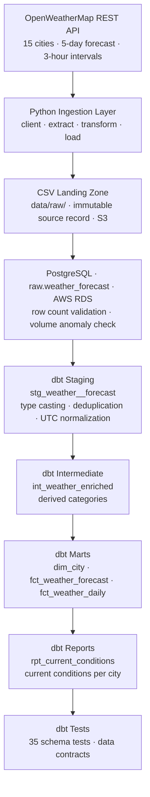
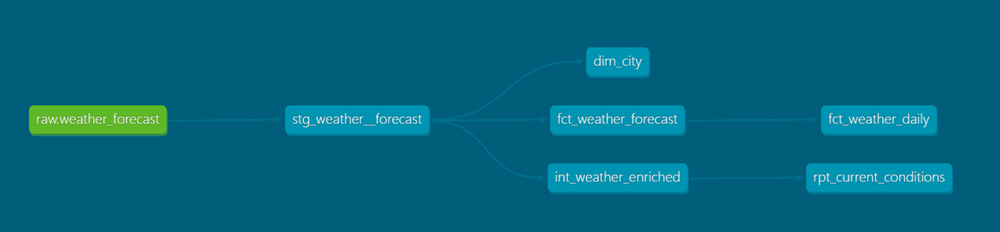

# Weather Data ELT Pipeline

Production-style ELT pipeline that ingests live weather forecast data from the OpenWeatherMap REST API across 15 global cities, validates and transforms it using dbt, and delivers analytics-ready dimensional models through a fully automated workflow built with Python, Apache Airflow, PostgreSQL, Docker, and GitHub Actions. Deployed on AWS (RDS, S3, EC2).

Designed, implemented, tested, documented, and maintained end to end.

---

## Key Engineering Features

- **REST API ingestion** — Pulls live 5-day forecast data for 15 cities with retry logic, timeout handling, and structured error logging
- **Idempotent loads** — Filename-keyed deduplication prevents duplicate ingestion across retries and backfills
- **Volume anomaly detection** — Each run's row count is compared against a 7-run rolling average; runs loading more than 50% fewer rows than the baseline fail before transformation begins
- **Schema contract enforcement** — Unknown API fields are detected at load time, dropped gracefully, and logged as warnings rather than crashing the pipeline
- **Layered dbt architecture** — Staging, intermediate, mart, and report layers with clear separation of concerns and incremental fact models using `NOT EXISTS` anti-joins
- **49 dbt schema tests** — Uniqueness, not-null, range, accepted-value, and referential integrity checks enforced across the warehouse
- **Staging deduplication** — Overlapping forecast windows across DAG runs resolved in the staging model using `ROW_NUMBER()`
- **CI/CD via GitHub Actions** — Automated pytest suite runs on every push to master
- **19 pytest unit tests** — Validates transform logic, schema enforcement, and file timestamp parsing
- **Structured logging** — Python `logging` module throughout the ingestion layer; Airflow task logs capture full run context including `dag_run_id`
- **Dockerized deployment** — Airflow and PostgreSQL run in isolated containers via Docker Compose; deployed to AWS EC2

---

## Architecture



---

## Screenshots

**Airflow DAG**


**dbt Lineage Graph**


---

## Engineering Metrics

| Metric | Value |
|---|---|
| Cities monitored | 15 across 4 continents |
| Pipeline schedule | Daily (`@daily` Airflow schedule) |
| dbt models | 6 across 4 layers |
| dbt schema tests | 49 |
| Pytest unit tests | 19 |
| Volume anomaly baseline | 7-run rolling average |
| Data quality gates | 3 (row count · anomaly check · dbt tests) |

---

## Production Engineering

This pipeline is designed around operational reliability, not just data transformation.

- **Automated scheduling** — Airflow DAG runs daily with no manual intervention required
- **Fail-loud design** — Tasks fail at the point of failure; bad data never reaches downstream models
- **Three data quality gates** — Row count validation, volume anomaly detection, and dbt schema tests run in sequence before marts are updated
- **Full lineage** — Every row carries `source_file_name`, `ingested_at`, and `dag_run_id` metadata for end-to-end traceability
- **Schema drift handling** — Unknown API fields are detected, dropped, and logged at load time; pipeline continues without human intervention
- **Backfill support** — Idempotent loads allow missed runs to be replayed without duplicates
- **CI/CD** — GitHub Actions runs the full pytest suite on every push before code reaches the production environment
- **Documentation** — Architectural diagrams, data dictionary, schema specs, and an incident log maintained throughout development

---

## Tech Stack

| Category | Tools |
|---|---|
| Orchestration | Apache Airflow |
| Transformation | dbt (dbt-postgres) |
| Warehouse | PostgreSQL · AWS RDS |
| Storage | AWS S3 |
| Compute | AWS EC2 · Docker · Docker Compose |
| Language | Python · SQL |
| Libraries | pandas · SQLAlchemy · psycopg2 · pytest |
| CI/CD | GitHub Actions |

---

## dbt Models

| Layer | Model | Description |
|---|---|---|
| Staging | `stg_weather__forecast` | Type casting, deduplication, UTC normalization |
| Intermediate | `int_weather_enriched` | Derived temp, wind, and precipitation categories |
| Mart | `dim_city` | City dimension, one row per city |
| Mart | `fct_weather_forecast` | Incremental 3-hour forecast fact table |
| Mart | `fct_weather_daily` | Daily aggregate (avg/min/max temp, precipitation totals) |
| Report | `rpt_current_conditions` | Current conditions view, one row per city |

---

## Repository Structure

```
weather_pipeline/
├── .github/
│   └── workflows/
│       └── ci.yml                     # GitHub Actions: pytest on push
├── dags/
│   └── weather_forecast_pipeline.py   # Airflow DAG definition
├── data/
│   ├── raw/                           # CSV output files from each DAG run
│   └── processed/
├── dbt/
│   ├── models/
│   │   ├── staging/weather/
│   │   │   ├── stg_weather__forecast.sql
│   │   │   ├── schema.yml
│   │   │   └── weather_sources.yml
│   │   ├── intermediate/
│   │   │   └── int_weather_enriched.sql   # Temp, wind, and precip categories
│   │   ├── marts/
│   │   │   ├── dim_city.sql               # City dimension
│   │   │   ├── fct_weather_forecast.sql   # Incremental 3-hour forecast fact
│   │   │   ├── fct_weather_daily.sql      # Daily aggregate fact
│   │   │   └── schema.yml
│   │   └── reports/
│   │       └── rpt_current_conditions.sql # Latest forecast per city
│   ├── macros/
│   │   └── generate_schema_name.sql       # Prevents dbt from prepending target schema
│   ├── profiles.yml                       # dev and prod targets
│   ├── dbt_project.yml
│   └── packages.yml
├── tests/
│   ├── conftest.py                    # Shared pytest fixtures
│   ├── test_transform.py              # Transform logic unit tests
│   └── test_postgres_loader.py        # postgres_loader unit tests
├── src/
│   ├── client.py                      # OpenWeatherMap API client
│   ├── extract.py                     # Calls API and returns raw records
│   ├── transform.py                   # Cleans and flattens records
│   ├── load.py                        # Writes records to CSV
│   ├── postgres_loader.py             # Loads CSVs into raw.weather_forecast
│   ├── main.py                        # CLI entrypoint (runs full pipeline locally)
│   ├── logging_config.py
│   └── utils.py
├── docs/
│   └── lineage.png                    # dbt lineage graph
├── config/
│   └── airflow.cfg
├── docker-compose.yml
├── Dockerfile
├── requirements.txt                   # Pipeline dependencies
├── requirements-airflow.txt           # Airflow dependencies
├── .env.example                       # Template for required environment variables
└── .env                               # Local environment variables (not committed)
```

---

## Database Schema

### raw.weather_forecast
Loaded directly from CSV files by Airflow. Includes all raw API fields plus pipeline metadata:

| Column | Type | Description |
|---|---|---|
| dt | bigint | Forecast Unix timestamp |
| dt_txt | text | Forecast timestamp as text |
| main_temp | numeric | Temperature (°F) |
| main_feels_like | numeric | Feels-like temperature |
| main_temp_min / max | numeric | Min/max temperature |
| main_humidity | bigint | Humidity % |
| main_pressure | bigint | Atmospheric pressure |
| wind_speed | numeric | Wind speed |
| wind_deg | bigint | Wind direction (degrees) |
| wind_gust | numeric | Wind gust speed |
| rain_3h | numeric | Rain volume (last 3 hours) |
| snow_3h | numeric | Snow volume (last 3 hours) — optional, null when no snow |
| clouds_all | bigint | Cloud coverage % |
| visibility | bigint | Visibility distance |
| pop | numeric | Probability of precipitation (0-1) |
| weather_main | text | High-level condition (Rain, Clouds, etc.) |
| weather_description | text | Detailed condition |
| city_id | bigint | City identifier |
| city_name | text | City name |
| city_country | text | Country code |
| city_population | bigint | City population |
| city_timezone | bigint | UTC offset in seconds |
| city_sunrise / sunset | bigint | Sunrise/sunset Unix timestamps |
| city_coord_lat / lon | numeric | Coordinates |
| source_file_name | text | Source CSV filename |
| source_file_ts | timestamp | Timestamp parsed from filename |
| ingested_at | timestamp | UTC time of ingestion |
| dag_run_id | text | Airflow DAG run ID |

### staging.stg_weather__forecast
dbt staging model. Casts all columns to correct types, normalizes timestamps to UTC, trims strings, and deduplicates by keeping the most recent ingestion for each `city_id` + `dt_utc` combination.

### intermediate.int_weather_enriched
Adds derived categorical columns on top of the staging model: `temp_category` (freezing / cold / mild / warm / hot), `wind_category` (calm / light / moderate / strong / storm), and `precip_type` (none / rain / snow / rain_and_snow).

### analytics.dim_city
City dimension table. One row per city, deduplicated using `ROW_NUMBER()` ordered by most recent forecast.

### analytics.fct_weather_forecast
Incremental 3-hour forecast fact table. Uses a `NOT EXISTS` anti-join on `(city_id, local_dt)` so new cities are ingested correctly without reprocessing existing rows.

### analytics.fct_weather_daily
Daily aggregate fact. Rolls up the 3-hour forecasts to one row per `city_id` + calendar date: avg/min/max temp, avg humidity, avg wind speed, total rain and snow.

### reports.rpt_current_conditions
Reporting view. Returns the single most-recent forecast per city with all enriched columns from `int_weather_enriched`. Ready for BI tool consumption.

---

## Failure Handling

The pipeline is designed to fail loudly at the point of failure rather than pass bad data downstream.

**API or network failure** — the `extract` task raises an exception if the API call fails or returns an unexpected response. Airflow retries the task twice with a 5-minute delay before marking the DAG run as failed.

To simulate: set `OPENWEATHER_API_KEY=invalid` in `.env`, restart the containers, and trigger the DAG. The `extract` task will fail with a non-200 response error. Downstream tasks do not run.

**Schema validation failure** — the `transform` task validates the structure of the API response before processing. If required fields (`list`, `city`) are missing or malformed, the task fails immediately and downstream tasks do not run.

To simulate: temporarily add `del data[0]["city"]` in `transform.py` before `validate_response` is called. The `transform` task will raise a `ValueError` with a clear message identifying the missing field.

**Volume anomaly failure** — the `volume_anomaly_check` task compares the current run's row count against a 7-run rolling average. If the current run loads more than 50% fewer rows than the rolling average, the DAG fails before dbt runs. The error message includes the `dag_run_id` so the anomalous run can be identified and inspected in the warehouse. The check is skipped automatically if fewer than 3 prior runs exist.

To simulate: temporarily set the threshold to 110% (`rolling_avg * 1.1`) and trigger the DAG. It will fail at `volume_anomaly_check` with a clear message including the run ID. Restore to `rolling_avg * 0.5` after verifying.

**Data quality failure** — the `dbt_test` task runs after `dbt_run` and enforces contracts on the staging model including uniqueness, not-null checks, range validation, and freshness. If any test fails, the DAG fails at `dbt_test` and the mart is not updated.

To simulate: run `UPDATE raw.weather_forecast SET weather_id = NULL WHERE city_id = 5128581 LIMIT 1;` in the warehouse, then trigger the DAG. The `dbt_test` task will fail on the `not_null` test for `weather_id`. Restore with `UPDATE raw.weather_forecast SET weather_id = 500 WHERE weather_id IS NULL;`.

This was observed in practice when overlapping forecast data caused a uniqueness violation, which was resolved by deduplicating in the staging model using `ROW_NUMBER()`.

---

## Testing

```bash
source venv/bin/activate
python -m pytest tests/ -v
```

Tests are split across two files:

- `test_transform.py` — validates `validate_response` (input shape, missing fields, wrong types) and `transform_records` (output schema, row count, city broadcast, bad date handling, weather field flattening)
- `test_postgres_loader.py` — validates `parse_source_file_ts` (valid filename, date/time parsing, full path, missing prefix, malformed timestamp)

Shared fixtures live in `conftest.py`. The CI workflow in `.github/workflows/ci.yml` runs the full suite on every push and pull request to master.

---

## Engineering Takeaways

- **Idempotency is not optional.** A pipeline that cannot be safely replayed is not production-ready. Filename-keyed deduplication and `NOT EXISTS` anti-joins made backfill and retry trivial to reason about.
- **Validate before transforming.** Catching bad data at the ingestion boundary — through row count checks, anomaly detection, and schema enforcement — is cheaper than remediating corrupt downstream models after the fact.
- **Documentation is a first-class artifact.** Maintaining a data dictionary, architectural diagrams, and an incident log throughout the build made the system easier to operate and debug, not just easier to explain.

---

## Known Limitations

**Schema drift from newly added API fields** — the `raw.weather_forecast` table schema is inferred from the first CSV loaded via pandas `to_sql`. When the OpenWeatherMap API returns a field not present in the original table (e.g., a newly added field like `main_dew_point`), the load task would previously fail with:

```
psycopg2.errors.UndefinedColumn: column "main_dew_point" of relation "weather_forecast" does not exist
```

**Current behavior** — `postgres_loader.py` now handles this gracefully. On each load, `align_columns_to_table` queries `information_schema` to compare the DataFrame columns against the actual table columns. Any unknown columns are dropped before the insert and a warning is logged:

```
WARNING - Dropping 1 unknown column(s) not present in raw.weather_forecast: ['main_dew_point'] — run ALTER TABLE to start capturing this data
```

The pipeline does not fail. The new field is ignored until a deliberate decision is made to capture it.

**To approve a new column** — once the warning is observed in the Airflow logs, run the appropriate `ALTER TABLE` in the warehouse:

```sql
ALTER TABLE raw.weather_forecast ADD COLUMN main_dew_point numeric;
```

The next DAG run will pick up the column automatically with no code changes required. At production scale this pattern would be replaced by a migration tool like Alembic that versions schema changes as auditable migration scripts.

**Conditionally-absent known fields** — a separate case from schema drift: `snow_3h` is only present in the API response at all when some city has snow in the forecast, so a snow-free first load would infer a table with no `snow_3h` column, breaking the dbt staging model which selects it unconditionally. `postgres_loader.py` guards against this via `KNOWN_OPTIONAL_COLUMNS` — such fields are forced onto the DataFrame as null before every load if the source CSV doesn't include them, so the table always has the column from the first insert onward, regardless of the day's weather.

**dbt-core and apache-airflow-providers-postgres must stay pinned in requirements-airflow.txt** — `dbt/models/marts/schema.yml` uses the `arguments:` generic-test syntax (dbt-core >=1.9), so `requirements-airflow.txt` pins `dbt-core==1.11.8`/`dbt-postgres==1.10.0` to match `requirements.txt` (the local, no-Docker venv path) exactly. Left unpinned, a fresh build can resolve an incompatible dbt-core (too old for the test syntax, or a pre-release) purely based on whatever's newest on PyPI that day — this has broken from-scratch builds before without anyone noticing, since Docker layer caching usually reused an old, working resolution. `apache-airflow-providers-postgres` is pinned to `5.10.0` in its own separate `RUN` step in the `Dockerfile` for the same reason (left unpinned, it resolves a release built for Airflow 3.x) and to avoid pip backtracking for a very long time when resolved together with the dbt pins. See the comments in `Dockerfile` and `requirements-airflow.txt` before changing any of these.

---

## Incident Log

### June 2026 — cascading failure from schema change and backfill

**What happened:**
3 consecutive DAG runs failed at `load_raw_table` because the OpenWeatherMap API began returning a new field (`main_dew_point`) that did not exist in `raw.weather_forecast`. The extract and transform tasks succeeded each time and CSVs were written to `data/raw/`, but the Postgres load failed before any rows were inserted.

**Fix 1 — schema:**
`ALTER TABLE raw.weather_forecast ADD COLUMN main_dew_point numeric` was run in the warehouse. `align_columns_to_table` was added to `postgres_loader.py` to handle future unknown columns gracefully rather than failing.

**Fix 2 — backfill:**
`make backfill` was run to load the 3 missed CSVs. Because `skip_if_loaded` uses the filename as the key, only the unloaded files were inserted — no duplicates.

**Second issue — null city metadata:**
The backfill also picked up older CSVs from before city columns were added to the extract logic. Those files loaded successfully but contributed 320 rows with null `city_id`, `city_name`, and related city columns.

**Caught by dbt tests:**
The `dbt_test` task failed on not-null constraints for `city_id`, preventing the mart from being updated with bad data. This was the intended behavior — the pipeline failed loudly rather than propagating nulls downstream.

**Fix 3 — data patch:**
The 320 rows were patched directly in `raw.weather_forecast` using a CTE UPDATE that sourced city values from valid rows with matching structure. The original CSVs were left untouched as the permanent record of what the API returned at that time. After patching, `dbt_run` and `dbt_test` both passed and the incremental model picked up all backfilled rows automatically.

---

## Setup

### Prerequisites
- Docker and Docker Compose
- OpenWeatherMap API key — sign up free at [openweathermap.org/api](https://openweathermap.org/api) (the free tier covers this pipeline's 5-day/3-hour forecast calls). New keys can take up to a couple hours to activate.

### Environment Variables

Copy `.env.example` to `.env` and fill in real values:

```bash
cp .env.example .env
```

```
OPENWEATHER_API_KEY=your_api_key_here
WAREHOUSE_USER=weather_user
WAREHOUSE_PASSWORD=weather_pass
WAREHOUSE_DB=weather_db
WAREHOUSE_HOST=postgres-warehouse
WAREHOUSE_PORT=5432
```

Also set `AIRFLOW_UID` to your host user's UID, so files the containers create (logs, dbt artifacts, raw CSVs) end up owned by you instead of a fixed container UID — this is Airflow's own documented setup step, not specific to this repo:

```bash
echo "AIRFLOW_UID=$(id -u)" >> .env
```

If you skip this, everything still runs — `airflow-init` falls back to UID `50000` — but `data/`, `logs/`, and dbt's `target/`/`dbt_packages/` directories will end up owned by that UID on your host, and you'll need `sudo chown` to edit files under them afterward. `dags/`, `src/`, and the rest of `dbt/` are left alone either way.

### Start Airflow

```bash
docker compose up
```

Airflow UI available at `http://localhost:8080` (admin / admin).
The warehouse Postgres is available at `localhost:5432`.

If either port is already in use, set `AIRFLOW_WEBSERVER_PORT` / `WAREHOUSE_HOST_PORT` in `.env` to remap the host side only — internal service-to-service traffic is unaffected.

Airflow pauses every DAG on creation by default (`AIRFLOW__CORE__DAGS_ARE_PAUSED_AT_CREATION`), so nothing — including a fresh deploy of this pipeline — runs unattended before a human enables it. `weather_forecast_pipeline` will sit `queued` if triggered until you unpause it:

```bash
docker compose exec airflow-scheduler airflow dags unpause weather_forecast_pipeline
```

(Same command for any new DAG you add — swap in its `dag_id`.)

### Create the Airflow Connection

After the containers are healthy, register the warehouse connection so Airflow can resolve credentials at runtime:

```bash
docker compose exec airflow-scheduler airflow connections add weather_warehouse \
    --conn-type postgres \
    --conn-host postgres-warehouse \
    --conn-login weather_user \
    --conn-password weather_pass \
    --conn-schema weather_db \
    --conn-port 5432
```

On Windows PowerShell, use a backtick instead of `\` for line continuation:

```powershell
docker compose exec airflow-scheduler airflow connections add weather_warehouse `
    --conn-type postgres `
    --conn-host postgres-warehouse `
    --conn-login weather_user `
    --conn-password weather_pass `
    --conn-schema weather_db `
    --conn-port 5432
```

The `postgres_loader.py` module tries this connection first and falls back to the `.env` environment variables if the connection is not found — so the pipeline still works locally without Docker.

---

## Running the Pipeline

### Via Airflow (recommended)

Trigger the DAG from the UI or CLI:

```bash
docker compose exec airflow-scheduler airflow dags trigger weather_forecast_pipeline
```

### Via CLI (local, no Docker)

```bash
source venv/bin/activate
python -m src.main
```

`main()` doesn't just load the CSV it just extracted — it calls `load_all_files()`, which loads *every* unloaded file already sitting in `data/raw/`, tagged under one `dag_run_id`. If that directory has accumulated many historical files (e.g. from months of local dev), one run of this command bulk-loads all of them at once. Harmless against a scratch database, but be aware if `WAREHOUSE_HOST`/`WAREHOUSE_PORT` happen to point at the same warehouse an Airflow deployment is also using — a single oversized `dag_run_id` group like that will skew `volume_anomaly_check`'s rolling average for every run afterward until it ages out of the last-7-runs window (or is deleted).

### Backfill existing CSV files

```bash
docker compose exec airflow-scheduler bash -c "
  for f in /opt/airflow/data/raw/output_*.csv; do
    python -m src.postgres_loader file --file-path \"\$f\"
  done
"
```

---

## dbt

dbt runs automatically as part of the Airflow DAG. To run manually:

```bash
source venv/bin/activate
cd dbt
dbt deps
dbt run
dbt test
```

`dbt deps` installs the packages listed in `packages.yml` into `dbt_packages/` (gitignored) — required once before the first `dbt run`/`dbt test`/`dbt source freshness`, and again after `packages.yml` changes.

### Target switching (dev / prod)

The `DBT_TARGET` environment variable controls which `profiles.yml` target is used. It defaults to `dev`. Set `DBT_TARGET=prod` in the Airflow environment (or CI) to run against the production warehouse.

### Lineage


`raw.weather_forecast` → `stg_weather__forecast` → `int_weather_enriched` → `fct_weather_forecast` / `fct_weather_daily` / `rpt_current_conditions`

To regenerate docs:

```bash
docker compose exec airflow-scheduler bash -c "cd /opt/airflow/dbt && dbt docs generate --profiles-dir /opt/airflow/dbt"
```

---

## Sample Output (raw CSV)

```
dt,visibility,pop,dt_txt,main_temp,main_feels_like,main_humidity,wind_speed,city_name,city_country,weather_main,...
1778284800,10000,0.2,2026-05-09 00:00:00,60.51,58.57,49,7.07,New York,US,Rain,...
1778295600,10000,0.0,2026-05-09 03:00:00,58.73,56.93,56,5.03,New York,US,Clouds,...
```
